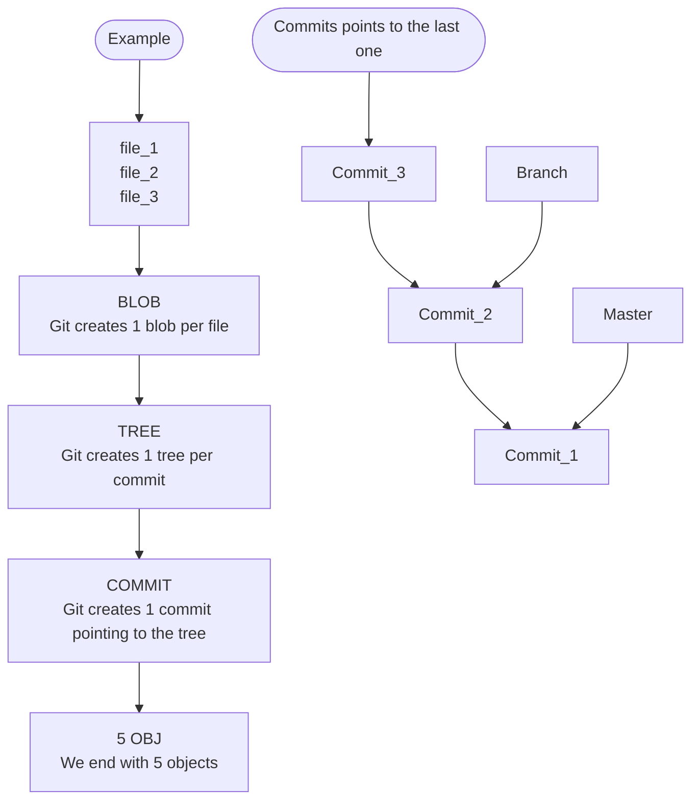
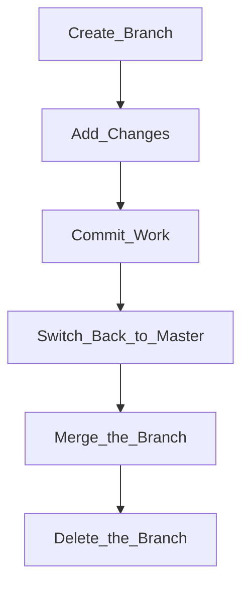
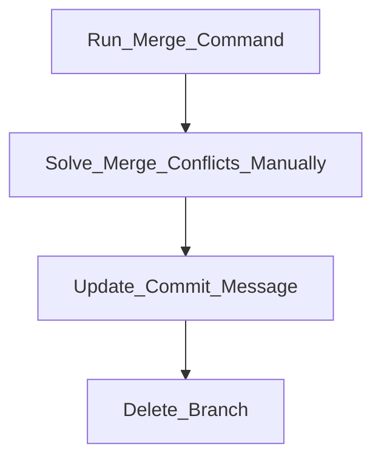

%%
> Tag: [[git]] [[branch]]
> Type: #type/literature/source 
> Status: #status/check-in
> Previous: 
> Next: 

> Branches: 

%%

> Context: [[@chacon2014Pro]] 

#issue/no-tag #issue/orphan #issue/no-tag 

---
# “Branching in a Nutshell”

- **TOC**
	- [[#Workflow]]
	- [[#Review]]

---
## Workflow

### The connection between commits and branches

1. Let's start with 3 files.
2. We stage (`add`) these files, so:
	1. Git stores a version and add the checksum to the staging area.
3. When we `commit`, git checksum the sub directories and the files.
4. It generates 1 `blob` per file.
5. After that, git creates a `tree` to track those blobs.
	1. The tree is used to recreate the snapshot taken by the commit.
6. Then, git creates a `commit object` and a pointer to the project tree.
7. Finally, the git repository has 5 object, the blobs, the commit object and the tree.
8. If we commit again, the new commit points to the last one.
9. If we create a branch, we just create a pointer to one of those commits to move around.
10. The Master branch is just a default branch created automatically when you create your first commit.



![[Pasted image 20220720174624.png]]

**Commands: basic git**

```bash
git add <file_name>
git commit -m "message."
git checkout -b <branch_name>
```

**Highlights**

> “When you create the commit by running git commit, Git checksums each subdirectory (in this case, just the root project directory) and stores those tree objects in the Git repository.” (“Pro Git”, 2014, p. 43)

> “Git then creates a commit object that has the metadata and a pointer to the root project tree so it can re-create that snapshot when needed.” (“Pro Git”, 2014, p. 43)

> “Your Git repository now contains five objects: one blob for the contents of each of your three files, one tree that lists the contents of the directory and specifies which file names are stored as which blobs, and one commit with the pointer to that root tree and all the commit metadata.” (“Pro Git”, 2014, p. 43)
“Creating a New Branch” (“Pro Git”, 2014, p. 45)

> “A branch in Git is simply a lightweight movable pointer to one of these commits.” (“Pro Git”, 2014, p. 44)

> “What happens if you create a new branch? Well, doing so creates a new pointer for you to move around.” (“Pro Git”, 2014, p. 45)

## Useful facts

> “The default branch name in Git is master.” (“Pro Git”, 2014, p. 44)

> “As you start making commits, you’re given a master branch that points to the last commit you made.” (“Pro Git”, 2014, p. 44)

> “Because a branch in Git is in actuality a simple file that contains the 40 character SHA-1 checksum of the commit it points to, branches are cheap to create and destroy.” (“Pro Git”, 2014, p. 49)

---
## Tracking and Switching branches

![[Pasted image 20220720182128.png]]

**HEAD pointer**


- The `HEAD` pointer shows where you are.
- It moves forward whenever we run `git commit`.
- The command `git log` shows where the `HEAD` is.
- The command `git checkout` switch between branches and it reverte the changes to the branch snapshot.


**Commands: log and HEAD pointer**

```bash
git log
git log --oneline --decorate
git log --oneline --decorate --graph --all
git checkout <branch_name>
```

**Highlights**

> “How does Git know what branch you’re currently on? It keeps a special pointer called HEAD.” (“Pro Git”, 2014, p. 45)

> “git log command that shows you where the branch pointers are pointing. This option is called --decorate.” (“Pro Git”, 2014, p. 46)

> “$ git log --oneline --decorate” (“Pro Git”, 2014, p. 46)

> “Switching Branches” (“Pro Git”, 2014, p. 46)

> “To switch to an existing branch, you run the git checkout command.” (“Pro Git”, 2014, p. 46)

> “This moves HEAD to point to the testing branch.” (“Pro Git”, 2014, p. 46)

> “The HEAD branch moves forward when a commit is made” (“Pro Git”, 2014, p. 47)

> “That command did two things. It moved the HEAD pointer back to point to the master branch, and it reverted the files in your working directory to the snapshot that master points to.” (“Pro Git”, 2014, p. 48)

> “HEAD moves when you checkout” (“Pro Git”, 2014, p. 48)

>“If you run git log --oneline --decorate --graph --all it will print the history of your commits” (“Pro Git”, 2014, p. 49)

---
## “Basic Branching” (“Pro Git”, 2014, p. 50)



1. Create a new branch.
2. Add some changes.
3. Commit your work.
	1. Note: git doesn't allow you to switch without saving the changes.
4. After finishing your changes, switch back to the parent branch.
5. While into the parent branch, run `merge` command to merge your work.
	1. If the changes is a direct upstream, you'll see the "fast-forward" message.
	2. If not, you'll have to handle merge conflicts.
6. Delete the child branch.

**Commands: basic branch**

```bash
git checkout -b <child_branch_name>
git add . && git commit -m "message"
git checkout <parent_branch>
git merge <child_branch>
git checkout -d <child_branch>
```

**Highlights**

> “you can run the git checkout command with the -b” (“Pro Git”, 2014, p. 50)

> “note that if your working directory or staging area has uncommitted changes that conflict with the branch you’re checking out, Git won’t let you switch branches.” (“Pro Git”, 2014, p. 51)

> “merge it back into your master branch to deploy to production. You do this with the git merge command:” (“Pro Git”, 2014, p. 52)

> “You’ll notice the phrase “fast-forward” in that merge. Because the commit pointed to by the branch you merged in was directly upstream of the commit you’re on, Git simply moves the pointer forward.” (“Pro Git”, 2014, p. 52)

> “To phrase that another way, when you try to merge one commit with a commit that can be reached by following the first commit’s history, Git simplifies things by moving the pointer forward because there is no divergent work to merge together—this is called a fast-forward.” (“Pro Git”, 2014, p. 52)

> “You can delete it with the -d option to git branch:” (“Pro Git”, 2014, p. 53)

---
## “Basic Merging” (“Pro Git”, 2014, p. 54)

1. As in basic branching, you finish your work.
2. Then, you switch branches.
3. Run `merge` command.
4. Solve merging conflicts.
	1. You need to do it manually.
	2. You just need to open the files with conflicts.
5. Run `commit` command after finishing the conflicts.
	1. It's interesting to update the commit message explaining how you solve the conflicts.
6. Delete branch.




**Highlights**

“In order to do that” (“Pro Git”, 2014, p. 54)

“All you have to do is check out the branch you want to merge into and then run the git merge command:” (“Pro Git”, 2014, p. 54)

“Instead of just moving the branch pointer forward, Git creates a new snapshot that results from this three-way merge and automatically creates a new commit that points to it.” (“Pro Git”, 2014, p. 55)

“Basic Merge Conflicts” (“Pro Git”, 2014, p. 55)

“Git adds standard conflict-resolution markers to the files that have conflicts, so you can open them manually and resolve those conflicts.” (“Pro Git”, 2014, p. 56)

“After you’ve resolved each of these sections in each conflicted file, run git add on each file to mark it as resolved. Staging the file marks it as resolved in Git.” (“Pro Git”, 2014, p. 56)

“You can run git status again to verify that all conflicts have been resolved:” (“Pro Git”, 2014, p. 57)

“ou can type git commit to finalize the merge commit.” (“Pro Git”, 2014, p. 57)

“You can modify that message with details about how you resolved the merge if you think it would be helpful to others looking at this merge in the future—why you did what you did, if it’s not obvious.” (“Pro Git”, 2014, p. 57)

## “Branch Management” (“Pro Git”, 2014, p. 58)

```shell
git branch -v
git branch --merged
git branch --no-merged
```


“The git branch” (“Pro Git”, 2014, p. 58)

“git branch -v” (“Pro Git”, 2014, p. 58)

“git branch --merged” (“Pro Git”, 2014, p. 58)

“Branches on this list without the \* in front of them are generally fine to delete with git branch -d;” (“Pro Git”, 2014, p. 58)

“git branch --no-merged” (“Pro Git”, 2014, p. 58)


## “Branching Workflows” (“Pro Git”, 2014, p. 58)

“Long-Running Branches” (“Pro Git”, 2014, p. 59)

“having only code that is entirely stable in their master branch” (“Pro Git”, 2014, p. 59)

“They have another parallel branch named develop or next that they work from or use to test stability” (“Pro Git”, 2014, p. 59)

“It’s used to pull in topic branches (short-lived branches, like your earlier iss53 branch) when they’re ready, to make sure they pass all the tests and don’t introduce bugs.” (“Pro Git”, 2014, p. 59)

“This technique allows you to context-switch quickly and completely” (“Pro Git”, 2014, p. 60)

![[Pasted image 20230227114541.png]]

![[Pasted image 20230227114559.png]]

![[Pasted image 20230227115013.png]]

![[Pasted image 20230227115029.png]]


## “Remote Branches” (“Pro Git”, 2014, p. 61)


“Remote branches are references (pointers) to the state of branches in your remote repositories.” (“Pro Git”, 2014, p. 61)

“They’re local branches that you can’t move” (“Pro Git”, 2014, p. 61)

“Remote branches act as bookmarks to remind you where the branches on your remote repositories were the last time you connected to them.” (“Pro Git”, 2014, p. 61)

“They take the form (remote)/(branch)” (“Pro Git”, 2014, p. 61)

““origin” is not special” (“Pro Git”, 2014, p. 62)

““origin” is the default name for a remote when you run git clone.” (“Pro Git”, 2014, p. 62)

“To synchronize your work, you run a git fetch origin command.” (“Pro Git”, 2014, p. 63)

![[Pasted image 20230227115052.png]]

![[Pasted image 20230227115122.png]]

![[Pasted image 20230227115150.png]]

![[Pasted image 20230227115212.png]]

![[Pasted image 20230227115233.png]]


“Pushing” (“Pro Git”, 2014, p. 65)

```shell
# git push origin main
git push <remote> <branch> # push local to remote branch
# git fetch origin
git fetch <remote> # fetch to origin - only give us a pointer to origin
# git checkout -b issue origin/issue
git checkout -b <branch> <remote>/<branch> # give us a local branch
```

“git push (remote) (branch)” (“Pro Git”, 2014, p. 65)

“Git automatically expands the serverfix branchname out to refs/heads/ serverfix:refs/heads/serverfix” (“Pro Git”, 2014, p. 65)

“Tracking Branches” (“Pro Git”, 2014, p. 66)

```shell
git checkout -b aux_main origin/main # set up other tracking branches
git checkout --track origin/main # shorthand git checkout -b aux_main ...
git branch -u origin/main # if you already have a local <main>
git branch --set-upstream-to origin/main # verbose
git push origin --delete main # delete the remote branch main
# git checkout -b aux_main origin/main
# git checkout --track origin/main
```

“Pulling” (“Pro Git”, 2014, p. 67)

“there is a command called git pull which is essentially a git fetch immediately followed by a git merge in most cases.” (“Pro Git”, 2014, p. 67)

“Rebasing” (“Pro Git”, 2014, p. 68)

“With the rebase command, you can take all the changes that were committed on one branch and replay them on another one.” (“Pro Git”, 2014, p. 69)

“It works by going to the common ancestor of the two branches (the one you’re on and the one you’re rebasing onto), getting the diff introduced by each commit of the branch you’re on, saving those diffs to temporary files, resetting the current branch to the same commit as the branch you are rebasing onto, and finally applying each change in turn.” (“Pro Git”, 2014, p. 69)

“At this point, you can go back to the master branch and do a fast-forward merge.” (“Pro Git”, 2014, p. 69)

“Often, you’ll do this to make sure your commits apply cleanly on a remote branch” (“Pro Git”, 2014, p. 70)

“Rebasing replays changes from one line of work onto another in the order they were introduced, whereas merging takes the endpoints and merges them.” (“Pro Git”, 2014, p. 70)

“You can take the changes on client that aren’t on server (C8 and C9) and replay them on your master branch by using the --onto option of git rebase:” (“Pro Git”, 2014, p. 71)

“Now you can fast-forward your master branch:” (“Pro Git”, 2014, p. 72)

“The Perils of Rebasing” (“Pro Git”, 2014, p. 73)

“Do not rebase commits that exist outside your repository.” (“Pro Git”, 2014, p. 73)

“When you rebase stuff, you’re abandoning existing commits and creating new ones that are similar but different.” (“Pro Git”, 2014, p. 73)

“If you treat rebasing as a way to clean up and work with commits before you push them, and if you only rebase commits that have never been available publicly, then you’ll be fine.” (“Pro Git”, 2014, p. 76)