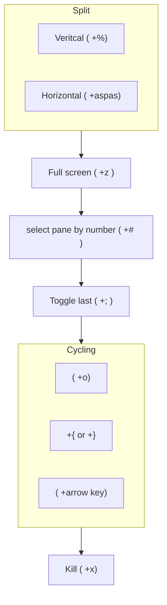

%%
> Tag: 
> Type: #
> Status: #status/check-in
> Previous: 
> Next: 

> Branches: 

%%

> Context: #issue/no-tag #issue/orphan #issue/no-type 

---
## Tmux - pane workflow





**Commands**

```bash
<prefix>+% # Split panes vertically
<prefix>+“ # Split panes horizontally
<prefix>+; # Toggle last active plane

<prefix>+x # Kill pane
<prefix>+q # Show pane numbers

# Cycling
<prefix>+o # Swap
<prefix>+{ # Move left
<prefix>+} # Move right
<prefix>+arrow key # Switching between panes
```