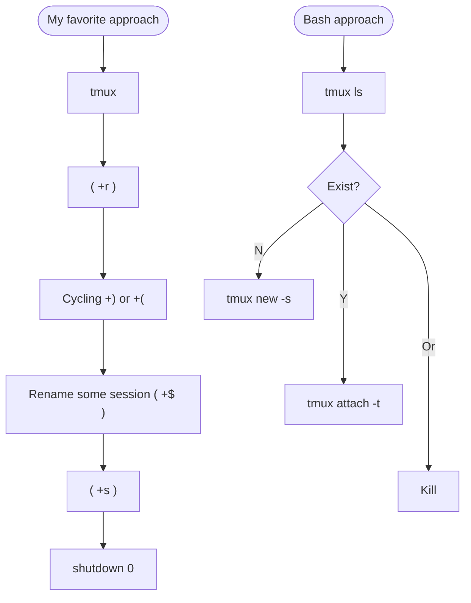

%%
> Tag: 
> Type: #
> Status: #status/check-in
> Previous: 
> Next: 

> Branches: 

%%

> Context: #issue/no-tag #issue/orphan #issue/no-type 

---
# Tmux - sessions workflow




**Commands**

```bash
# my favorite
tmux
<prefix> + r
<prefix> + ( or + )
<prefix> + $
<prefix> + s

# bash approach
tmux ls
tmux new -s <session_name>
tmux attach -t <session_name>
tmux kill-session -t <session_name>

# tmux command line
: new
: new -s <name>
```