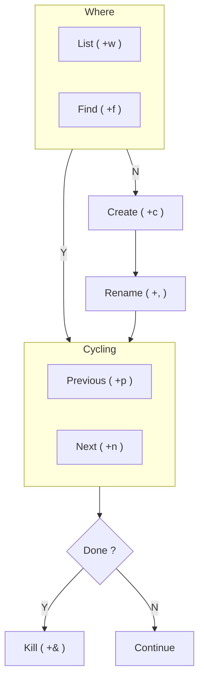

%%
> Tag: 
> Type: #
> Status: #status/check-in
> Previous: 
> Next: 

> Branches: 

%%

> Context: #issue/no-tag #issue/orphan #issue/no-type 

---
## Tmux - window workflow




**Commands**

```bash
<prefix>+w  # List
<prefix>+f  # Find 

<prefix>+c  # New 
<prefix>+,  # Rename
<prefix>+&  # Kill 

<prefix>+n  # Next
<prefix>+p  # Previous 
```